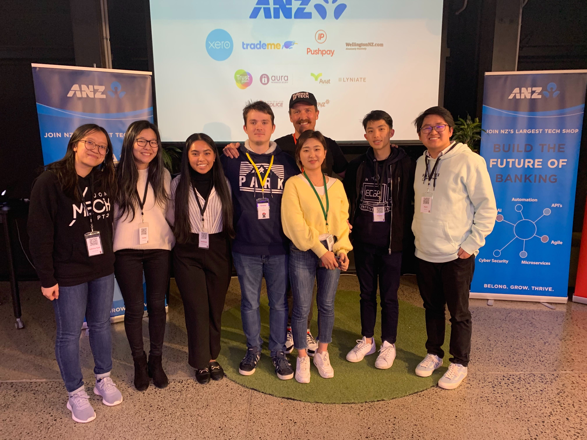
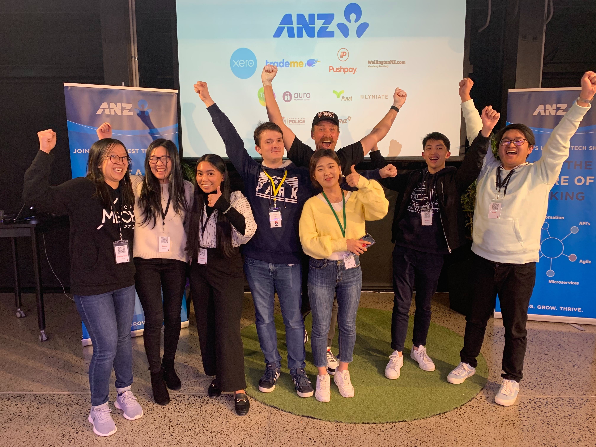

# [Krayon Kafe](https://krayon-kafe.herokuapp.com/)
Krayon Kafe is an online web application that allows users to provide a location (e.g. Panmure, Ponsonby) that shows them the cafes around the area, as well as provide Google Map Markers that show them where the cafes are.  

This project was built over the weekend of 1 August - 2 August, as part of the Create Camp hosted by [Summer of Tech](https://summeroftech.co.nz/) and [ANZ](https://www.anz.co.nz/personal/). This application uses the ZenbuAPI for location data, as well as a GoogleMaps API to show users the location of the cafes.  

# Motivation
The theme for this year's Create Camp was "Customer, Community and Cloud". Across the team, we've observed a huge influx of overseas kiwis moving back to New Zealand as a result of COVID-19. We decided it would be a great idea to help re-familiarize these kiwis by building a web application that converts the currency that they were comfortable with, to NZD (New Zealand Dollars), as well as find them the best place to get a cup of coffee at a reasonable price.  

This weekend was a huge learning opportunity for all of us, as the developers had minimal to no experience using ExpressJS, as well as deploying a web application to Heroku. So we were extremely excited to be able to parse data and be able to see the location appear on our web application. 

# Results
We were able to deploy our website to Heroku with the help our our great mentor Erwan! Here's a photo of the [website](https://krayon-kafe.herokuapp.com/):  
  

# Installation 
To get this website working on your local machine, first clone the repository. Using Visual Studio Code, open up a terminal and do the following:  
```
$ cd team_krayon
$ npm install express --save 
$ node index.js 
```  
** Note: You may need to generate your own Google Maps API key to get it working on your machine. As of 03/08/2020, it should still work on your local machine. You can change this in the ```views/pages/index.ejs``` file.**

# Tech Stack used:
### Languages/Frameworks used:  
Mainly HTML, CSS and JavaScript.  
In addition to JavaScript, we also used several other frameworks/libraries: [jQuery](https://jquery.com/), [Bootstrap](https://getbootstrap.com/), [Node](https://nodejs.org/en/), [Express](https://expressjs.com/), and Axios. 

### APIs used:  
[ZenbuAPI](https://www.zenbu.co.nz/about/xml) for location data.  
[Google Maps JavaScript API](https://developers.google.com/maps/documentation/javascript/overview) to visually show where the location of the cafes queried are.  

### Collaboration and Deployment:  
[Github](https://github.com/) for collaboration.  
[Heroku](https://www.heroku.com/) for deployment.  


# Team Photos
Here's a photo of the incredible team (and also [Trent](https://www.linkedin.com/in/trentmankelow/)):  
  


# Contributors:
**Developer** - [Sunny Feng](https://www.linkedin.com/in/sunnyfeng617/)    
**Designer** - [Hwajung Jin](https://www.linkedin.com/in/hwajung-jin-7b012217b/)  
**Developer** - [Jemimah Martinez](https://www.linkedin.com/in/jemimah-martinez-a0924a18b/)  
**Developer** - [Ryan Tan](https://www.linkedin.com/in/rtan18/)  
**Developer** - [Sabrina Teoh](https://www.linkedin.com/in/sabrina-teoh/)  
**Developer** - [Martin Tiangco](https://www.linkedin.com/in/martintiangco/)  

## Our wonderful mentor:  
[Erwan Joly](https://www.linkedin.com/in/erwan-joly/)  

# Thanks to:
Thanks to [Summer of Tech](https://summeroftech.co.nz/) for organizing Create Camp 2020, our team had a lot of fun learning new technologies and working together. We would also like to thank the sponsors [ANZ](https://www.anz.co.nz/personal/) for sponsoring the event! 